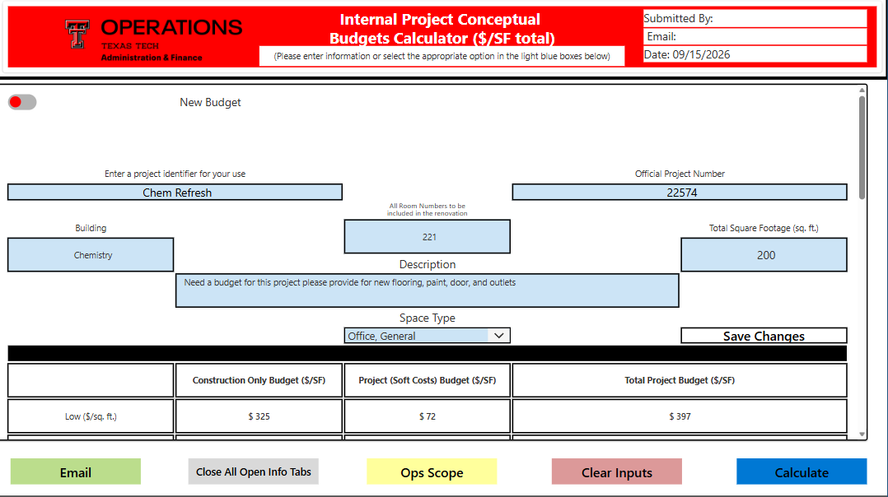
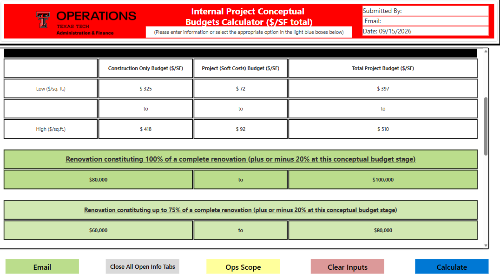
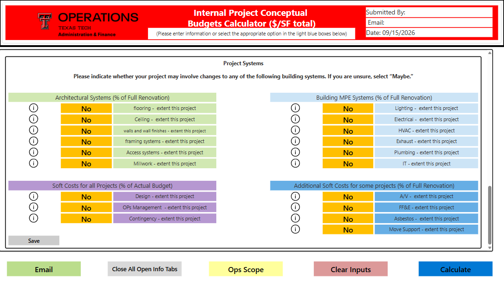
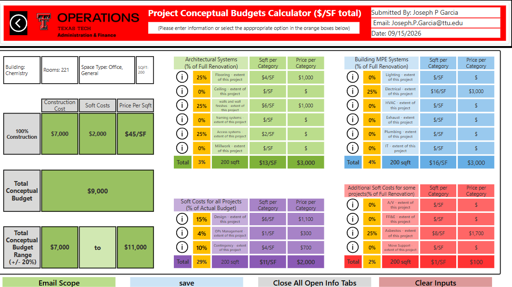
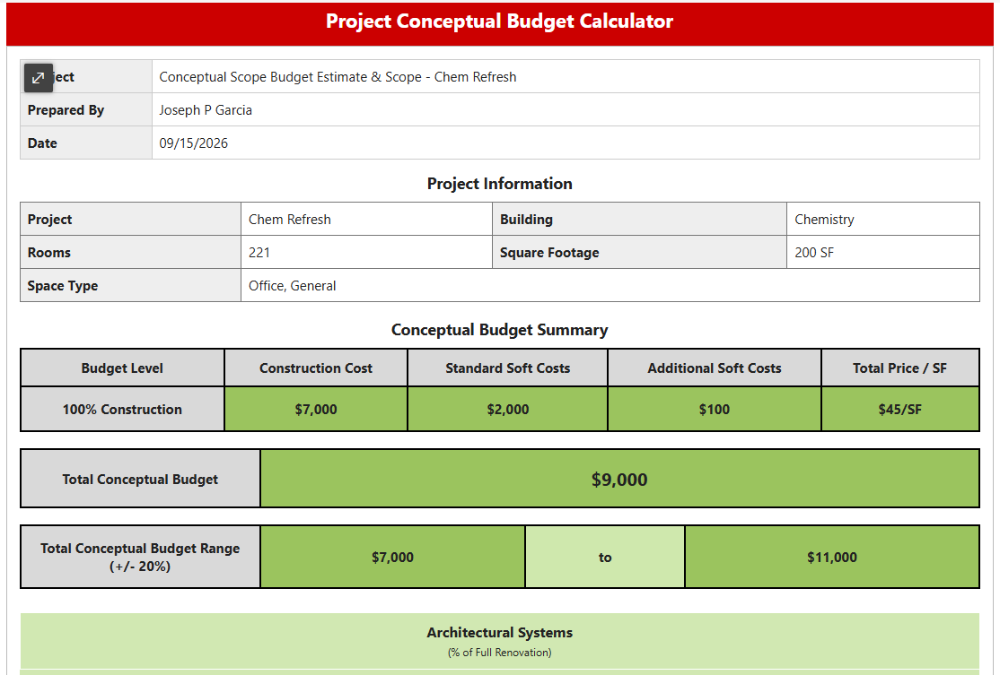

# Conceptual Project Budget Calculator

A Microsoft Power Apps application designed to support conceptual renovation budgeting, project tracking, scope development, and budget documentation.

The application uses Microsoft Power Apps as the front end, Power Fx for business logic, and SharePoint as the primary data layer.

## Project Overview

This project was developed to improve the conceptual budgeting workflow for renovation projects.

The application allows users to:

- Enter project information
- Calculate conceptual renovation budget ranges
- Compare low and high cost-per-square-foot estimates
- Estimate 100%, 75%, and 50% renovation scenarios
- Identify project systems that may be included in the renovation
- Develop a more detailed internal scope estimate
- Save and update project records
- Look up previously created projects
- Generate formatted email budget summaries
- Store related project and scope information in SharePoint

## Technologies

- Microsoft Power Apps
- Power Fx
- SharePoint Online
- Microsoft 365
- HTML email generation
- GitHub

## Application Architecture

The application uses multiple SharePoint lists to separate customer-facing information, internal project information, and scope data.

### Main Data Sources

**External Customer Data**

Stores the initial project information and conceptual budget generated from the customer-facing calculator.

**Customer Scope**

Stores customer selections for project systems such as flooring, walls, HVAC, electrical, design, contingency, and other project scope categories.

**Budget Data Tracker**

Stores the internal project record, official project number, conceptual budget calculations, and final project information.

**Scope Data**

Stores the detailed internal scope calculation, including architectural systems, MPE systems, standard soft costs, and additional soft costs.

Project records are connected using identifiers such as the External ID, Project Number, and Customer Identifier.

For a full explanation of the data model, see:

[Data Model and Architecture](documentation/data-model-and-architecture.pdf)

## Main Calculator

The internal calculator allows staff to create a new conceptual budget or retrieve an existing project.

Users can enter:

- Customer Identifier
- Official Project Number
- Building
- Room Numbers
- Square Footage
- Project Description
- Space Type

The calculator determines low and high construction cost-per-square-foot values using the selected space type and available cost reference data.

## Budget Calculation

The application calculates conceptual renovation budget ranges based on square footage, construction cost per square foot, and project soft costs.

The calculator produces:

- Construction-only cost per square foot
- Soft cost per square foot
- Total project cost per square foot
- 100% renovation budget range
- 75% renovation budget range
- 50% renovation budget range

## Project Scope Selection

The project scope section allows users to identify systems that may be affected by the renovation.

Categories include:

### Architectural Systems

- Flooring
- Ceiling
- Walls and Wall Finishes
- Framing Systems
- Access Systems
- Millwork

### Building MPE Systems

- Lighting
- Electrical
- HVAC
- Exhaust
- Plumbing
- IT

### Standard Soft Costs

- Design
- Operations Management
- Contingency

### Additional Project Costs

- A/V
- FF&E
- Asbestos
- Move Support

Selections can be stored as Yes, No, or Maybe for early project planning.

## Detailed Scope Calculator

The internal scope calculator allows staff to develop a more detailed conceptual estimate.

Individual project systems can be assigned percentages representing the extent of renovation.

The application then calculates:

- Architectural system percentage
- MPE system percentage
- Construction cost
- Standard soft costs
- Additional soft costs
- Price per square foot
- Total conceptual budget
- Conceptual budget range

## SharePoint Integration

The application uses Power Fx `LookUp()` and `Patch()` functions to retrieve, create, and update SharePoint records.

The system supports both:

- Creating new project records
- Updating previously saved projects

The internal project workflow also checks for duplicate official project numbers before saving.

Linked customer records can be updated when an internal project is associated with an existing External ID.

## Project Lookup

Existing projects can be retrieved using:

- SharePoint record ID
- Official Project Number
- Customer Identifier

When a record is loaded, the application restores project information, budget values, and related scope selections.

## Email Reporting

The application generates formatted project budget summaries that can be sent by email.

Reports include:

- Project information
- Conceptual budget summary
- Budget range
- Architectural system scope
- MPE system scope
- Standard soft costs
- Additional project costs

## Source Code

The repository includes selected Power Apps screen source for reviewing the Power Fx logic and application structure.

### Internal Calculator

[`source/screens/Budget-Calculator.yaml`](source/screens/Budget-Calculator.yaml)

Includes:

- Project creation
- Project lookup
- SharePoint save/update logic
- Budget calculations
- Customer scope integration
- Email generation

### Internal Scope Calculator

[`source/screens/scope_finder.yaml`](source/screens/scope-finder.yaml)

Includes:

- Scope percentage controls
- Scope calculations
- Construction cost calculations
- Soft cost calculations
- SharePoint scope persistence

## Packaged Application

The packaged Power Apps application is available here:

[`app/ConceptualBudgetCalculator.msapp`](app/Conceptual-budget-powerapps.msapp)

## Skills Demonstrated

This project demonstrates experience with:

- Low-code application development
- Power Fx
- SharePoint data modeling
- CRUD operations
- Relational data design
- Business process automation
- Data validation
- Project lookup workflows
- Cost estimation logic
- Application state management
- HTML email generation
- Technical documentation
- User interface design

## Project Status

The application is functional and continues to be improved as additional project data and workflow requirements are identified.

Potential future improvements include:

- Historical budget analytics
- Power BI reporting
- Improved mobile responsiveness
- Automated project performance tracking
- Comparison between conceptual estimates and actual project costs
- Expanded cost forecasting using historical project data

## Author

Joseph Garcia

Data Science | Business Systems | Power Platform | Analytics
